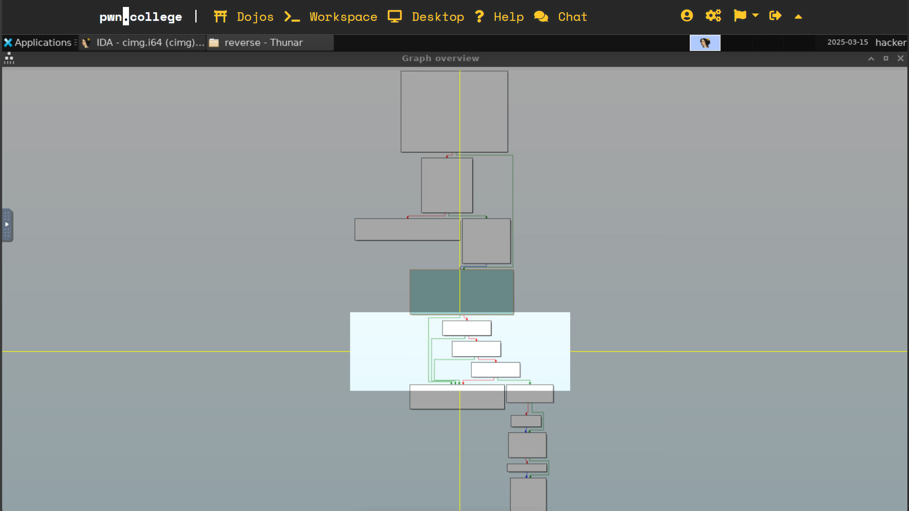

I use gdb to see the code and IDA to see control flow.

As I know, magic numbers are the starting 16 bytes of the file. This information may make the challenge easier.

Use IDA to open the `/challenge/cimg` file, it shows it's an ELF file. Let me read it.
```s
Dump of assembler code for function main:
   0x0000000000401500 <+0>:     endbr64
   0x0000000000401504 <+4>:     push   rbp
   0x0000000000401505 <+5>:     mov    rbp,rsp
   0x0000000000401508 <+8>:     push   rbx
   0x0000000000401509 <+9>:     sub    rsp,0x38
   0x000000000040150d <+13>:    mov    DWORD PTR [rbp-0x24],edi
   0x0000000000401510 <+16>:    mov    QWORD PTR [rbp-0x30],rsi
   0x0000000000401514 <+20>:    mov    QWORD PTR [rbp-0x38],rdx
   0x0000000000401518 <+24>:    mov    rax,QWORD PTR fs:0x28
   0x0000000000401521 <+33>:    mov    QWORD PTR [rbp-0x18],rax
   0x0000000000401525 <+37>:    xor    eax,eax
   0x0000000000401527 <+39>:    mov    DWORD PTR [rbp-0x1c],0x0
   0x000000000040152e <+46>:    mov    DWORD PTR [rbp-0x20],0x1
   0x0000000000401535 <+53>:    cmp    DWORD PTR [rbp-0x24],0x1
   0x0000000000401539 <+57>:    jle    0x4015b7 <main+183>
```
This part shows the initilization of stack and the first branch of process.
It allocates 0x38 bytes and move the args of main function(`int argc`, `char *argv[]`, `char *envp[]`) to stack.

Then set `eax` to zero, set some value to stack and check if `argc`(in `[rbp-0x1c]`) is bigger than one.

See the graph in IDA, I know it's okay to input `argv` or not, because the flow arrows reaches the same destination.
Let me go to `<main+183>`.
```s
   0x00000000004015b7 <+183>:   lea    rax,[rbp-0x1c]
   0x00000000004015bb <+187>:   mov    r8d,0xffffffff
   0x00000000004015c1 <+193>:   lea    rcx,[rip+0xb58]        # 0x402120
   0x00000000004015c8 <+200>:   mov    edx,0x4
   0x00000000004015cd <+205>:   mov    rsi,rax
   0x00000000004015d0 <+208>:   mov    edi,0x0
   0x00000000004015d5 <+213>:   call   0x40143d <read_exact>
   0x00000000004015da <+218>:   movzx  eax,BYTE PTR [rbp-0x1c]
   0x00000000004015de <+222>:   cmp    al,0x63
   0x00000000004015e0 <+224>:   jne    0x4015fa <main+250>
   0x00000000004015e2 <+226>:   movzx  eax,BYTE PTR [rbp-0x1b]
   0x00000000004015e6 <+230>:   cmp    al,0x49
   0x00000000004015e8 <+232>:   jne    0x4015fa <main+250>
   0x00000000004015ea <+234>:   movzx  eax,BYTE PTR [rbp-0x1a]
   0x00000000004015ee <+238>:   cmp    al,0x4d
   0x00000000004015f0 <+240>:   jne    0x4015fa <main+250>
   0x00000000004015f2 <+242>:   movzx  eax,BYTE PTR [rbp-0x19]
   0x00000000004015f6 <+246>:   cmp    al,0x47
   0x00000000004015f8 <+248>:   je     0x401610 <main+272>
   0x00000000004015fa <+250>:   lea    rdi,[rip+0xb42]        # 0x402143
   0x0000000000401601 <+257>:   call   0x401140 <puts@plt>
   0x0000000000401606 <+262>:   mov    edi,0xffffffff
   0x000000000040160b <+267>:   call   0x401210 <exit@plt>
   0x0000000000401610 <+272>:   cmp    DWORD PTR [rbp-0x20],0x0
   0x0000000000401614 <+276>:   je     0x401620 <main+288>
   0x0000000000401616 <+278>:   mov    eax,0x0
   0x000000000040161b <+283>:   call   0x401316 <win>
```
This part calls `read_exact(0x0, rbp-0x1c, 0x4, 0x402120, 0xffffffff)` and
then compare 4 bytes(from `[rbp-0x19]` to `[rbp-0x1c]`) in stack with certain bytes `cIMG`.
If the same, then call `win` func, ohterwise to `exit`.

I guess the `read_exact` func is just read 4 bytes from `[rbp-0x19]` to `[rbp-0x1c]`.
So the writeup should be `printf "cIMG" | /challenge/run`.

The control flow is more obvious in IDA:


```s
   0x000000000040153b <+59>:    mov    rax,QWORD PTR [rbp-0x30]   ; load the first pointer of argv (see <main+16>)
   0x000000000040153f <+63>:    add    rax,0x8                    ; pointer of argv[1]
   0x0000000000401543 <+67>:    mov    rbx,QWORD PTR [rax]
   0x0000000000401546 <+70>:    mov    rax,QWORD PTR [rbp-0x30]
   0x000000000040154a <+74>:    add    rax,0x8
   0x000000000040154e <+78>:    mov    rax,QWORD PTR [rax]
   0x0000000000401551 <+81>:    mov    rdi,rax
   0x0000000000401554 <+84>:    call   0x401160 <strlen@plt>      ; get strlen of argv[1]
   0x0000000000401559 <+89>:    sub    rax,0x5
   0x000000000040155d <+93>:    add    rax,rbx     ; now rax = argv[1] + strlen(argv[1]) - 0x5, points to the 5 chars in the end.
   0x0000000000401560 <+96>:    lea    rsi,[rip+0xb85]        # 0x4020ec ; use x/1gxs to see it's ".cimg"
   0x0000000000401567 <+103>:   mov    rdi,rax
   0x000000000040156a <+106>:   call   0x4011d0 <strcmp@plt>
   0x000000000040156f <+111>:   test   eax,eax
   0x0000000000401571 <+113>:   je     0x40158e <main+142>     ; if equal, go to <main+142>
   0x0000000000401573 <+115>:   lea    rdi,[rip+0xb7e]        # 0x4020f8
   0x000000000040157a <+122>:   mov    eax,0x0
   0x000000000040157f <+127>:   call   0x401190 <printf@plt>
   0x0000000000401584 <+132>:   mov    edi,0xffffffff
   0x0000000000401589 <+137>:   call   0x401210 <exit@plt>
   0x000000000040158e <+142>:   mov    rax,QWORD PTR [rbp-0x30]
   0x0000000000401592 <+146>:   add    rax,0x8                   ; points to argv[1]
   0x0000000000401596 <+150>:   mov    rax,QWORD PTR [rax]
   0x0000000000401599 <+153>:   mov    esi,0x0
   0x000000000040159e <+158>:   mov    rdi,rax
   0x00000000004015a1 <+161>:   mov    eax,0x0
   0x00000000004015a6 <+166>:   call   0x401200 <open@plt>     ; open(argv[1], 0), read mode
   0x00000000004015ab <+171>:   mov    esi,0x0
   0x00000000004015b0 <+176>:   mov    edi,eax
   0x00000000004015b2 <+178>:   call   0x401180 <dup2@plt>     ; redirect stdin to the opened file
```
